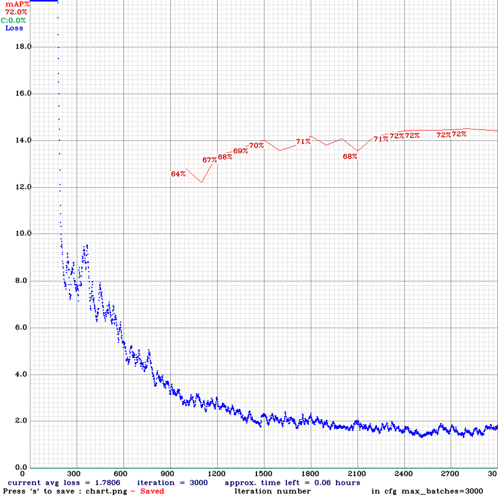
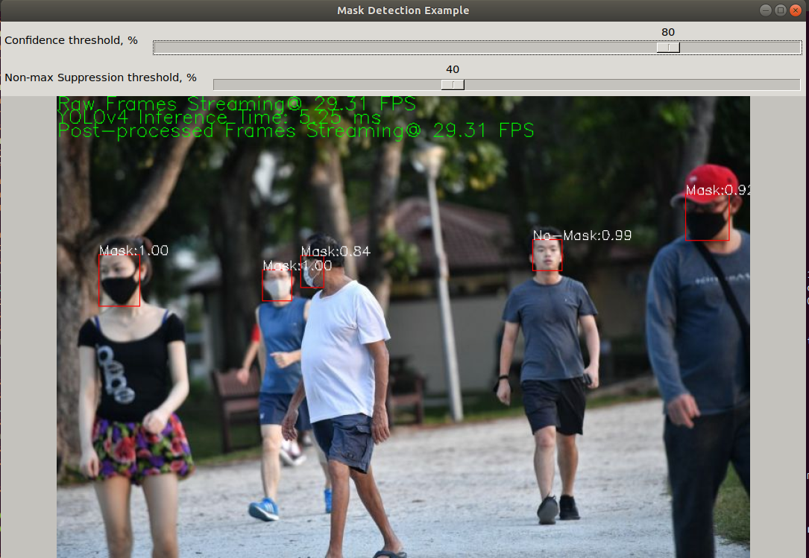

# Real-Time Mask Detection with YOLOv4 and OpenCV


## About

Demonstration of how to build a real-time, multi-threaded mask detector using OpenCV's [Deep Neural Network module](https://docs.opencv.org/4.5.0/d6/d0f/group__dnn.html) for inference with [YOLOv4](https://arxiv.org/abs/2004.10934).  [Darknet](https://github.com/AlexeyAB/darknet) is used for training the network.  The sections below outline how to reproduce your own demonstration of the gif above.

The hardware setup used was:

* [Intel Core i7-6800K 6-Core 3.4GHz processor](https://www.newegg.com/intel-core-i7-6th-gen-core-i7-6800k/p/N82E16819117649)
* [GeForce GTX 1080 Ti](https://www.nvidia.com/en-sg/geforce/products/10series/geforce-gtx-1080-ti/)

## Dependencies (just use Docker)

The following NVIDIA dependencies were used:

* [NVIDIA driver](https://www.nvidia.com/Download/driverResults.aspx/164073/en-us) version == 450.80.02
* [CUDA toolkit](https://developer.nvidia.com/cuda-toolkit) version == 10.2
* [cuDNN](https://developer.nvidia.com/cudnn) version == 8.0.4.30 _You will need an NVIDIA developer account to download this_

If you have Docker installed with the [nvidia-runtime](https://github.com/NVIDIA/nvidia-docker) configured properly, you can use the [Dockerfile](Dockerfile) provided with this repo to setup the development environment.  _I highly recommend this approach._

If you choose not to go the Docker route, you can follow the install steps from the [Dockerfile](Dockerfile) to configure your environment.

## Training

_I provide links to the final trained weights for this demo [here](#download-pre-trained-task-specific-weights); if you want to go straight to inference, skip this section and start from there_.

### Download the dataset

[Dataset](https://www.dropbox.com/s/6gewe947ake1g95/kaggle_and_no-mask_dataset.zip?dl=1).  This dataset has been prepared with the [prerequisite YOLO format](https://www.arunponnusamy.com/preparing-custom-dataset-for-training-yolo-object-detector.html) already satisfied.

### Prepare the dataset

There are python scripts provided to do final setup of the training and validation sets:

* [`cleanup_filenames.py`](data/python/cleanup_filenames.py) - normalizes file extensions for images in training set
* [`prepare_dataset.py`](data/python/prepare_dataset.py) - splits dataset into training and validation sets; writes output filenames to text file

### Train the network

If you wish to train your network end-to-end, you can follow the instructions from [AlexeyAB's Darknet fork](https://github.com/AlexeyAB/darknet#how-to-train-to-detect-your-custom-objects)
[darknet weights](https://drive.google.com/open?id=1JKF-bdIklxOOVy-2Cr5qdvjgGpmGfcbp).

At the end of training, you should see an image like the following:



## Download pre-trained task-specific weights

I've already trained the network on the dataset linked above.  If you want to just use these and skip training, here's the links:

* [(Height, Width) = (256, 256)](https://drive.google.com/file/d/1TRixgeK0tvrcxfgcCoDZqlZTmCW1hThS/view?usp=sharing)
* [(Height, Width) = (416, 416)](https://drive.google.com/file/d/1aN66YAFzePw0Ioi_B5mU5PXH_3jDw7mB/view?usp=sharing)

## Build

After you've cloned this repository, you can build the code with:

```bash
mkdir build && cd build && cmake .. && make -j2
```

## Running the app

### View available command-line options

```bash
# from build directory
./maskDetector -h
```

will show all available options, with descriptions.

### Running on sample image

[Download sample image](https://www.dropbox.com/s/g905k4r1git5kbx/test-image3.jpg?dl=1)

```bash
# from build directory
# - use "-o" option if you wish to create a video showing the inferred bounding boxes
./maskDetector -i={rel-path-to-image-file} --config=../data/yolo/{desired-cfg-file} --weights={rel-path-to-weights-file} --classes=../data/yolo/class.names {-o={rel-path-to-output-video-file}}
```

### Running on sample video

[Download sample video](https://www.dropbox.com/s/pds0w3z5y7w89oz/test-video1.mp4?dl=1).

```bash
# from build directory
# - use "-o" option if you wish to create a video showing the inferred bounding boxes
./maskDetector -i={rel-path-to-video-file} --config=../data/yolo/{desired-cfg-file} --weights={rel-path-to-weights-file} --classes=../data/yolo/class.names {-o={rel-path-to-output-video-file}}
```

### Running on webcam

```bash
# from build directory
# - use "-o" option if you wish to create a video showing the inferred bounding boxes
./maskDetector --config=../data/yolo/{desired-cfg-file} --weights={rel-path-to-weights-file} --classes=../data/yolo/class.names {-o={rel-path-to-output-video-file}}
```

### Expected output GUI



You can adjust the confidence and non-maximum suppression threshold values during app execution.  Experiment away!

## Other References

* [Object Detection Example from OpenCV](https://docs.opencv.org/3.4/d4/db9/samples_2dnn_2object_detection_8cpp-example.html#_a20)
* [YOLO example from LearnOpenCV](https://www.learnopencv.com/deep-learning-based-object-detection-using-yolov3-with-opencv-python-c)
* [Darknet](https://github.com/AlexeyAB/darknet)
